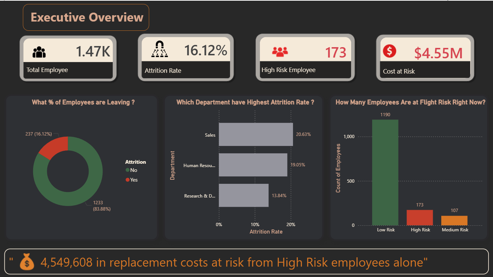
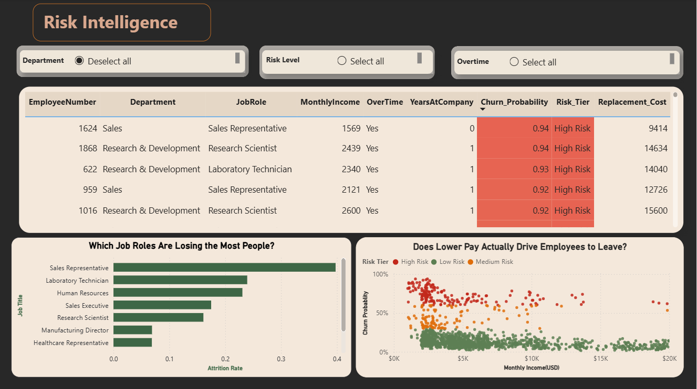
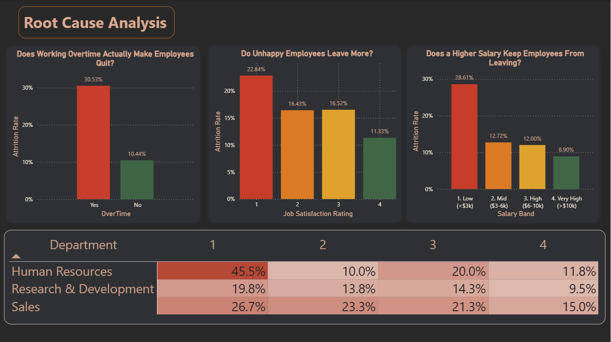

#  Employee Attrition & HR Analytics

> **Can we predict which employees will leave  before they do?**  
> This end-to-end HR analytics project identifies flight-risk employees, uncovers the root causes of attrition, and quantifies **$4.5M in replacement costs at risk**  giving HR leadership an actionable retention strategy backed by data.

---

##  Dashboard Preview

### Executive Overview


### Risk Intelligence


### Root Cause Analysis


---

##  Problem Statement

Companies lose between **0.5x to 2x an employee's annual salary** every time someone leaves  through recruiting, onboarding, training, and lost productivity. Yet most HR teams find out an employee is leaving only when the resignation letter arrives.

**This project answers three questions:**
1. **Who** is most likely to leave in the next 90 days?
2. **Why** are they leaving — what are the root causes?
3. **How much** will it cost if we don't act?

---

##  Key Findings

| Finding | Insight |
|---|---|
|  16.1% attrition rate | 1 in 6 employees leaves  ongoing cost burden |
|  Overtime  3x attrition risk | 30.5% vs 10.4%  most controllable lever |
|  Low salary band has 28.6% attrition | Targeted pay review = highest retention ROI |
|  Sales dept leads attrition at 20.6% | Quota pressure + low pay driving exits |
|  First 2 years  danger window | 30% of all leavers exit within 2 years |
|  Low job satisfaction doubles flight risk | Pulse surveys can catch this early |

---

##  Financial Impact

```
 High Risk Employees:         173  (11.8% of workforce)
 Medium Risk Employees:       107  (7.3% of workforce)

 Replacement cost at risk (High Risk):    $4,549,608
 Replacement cost at risk (Medium Risk):  $2,637,216

 Retention intervention for top 50 high-risk employees
   could save an estimated $1.2M in replacement costs
```

---

##  Tools & Technologies


---

##  Project Structure

```
employee-attrition-hr-analytics/
│
├──  notebooks/
│   ├── 01_Attrition_EDA.ipynb          # Exploratory Data Analysis
│   ├── 02_SQL_Attrition_Data.ipynb     # SQL analysis (17 queries)
│   └── 03_Attrition_ML_Model.ipynb     # ML model + risk scoring
│
├──  dashboard/
│   ├── hr.pbix                         # Power BI file
│   └── screenshots/
│       ├── executive_overview.png
│       ├── risk_intelligence.png
│       └── root_cause_analysis.png
│
├──  data/
│   └── WA_Fn-UseC_-HR-Employee-Attrition.csv
│
├──  output/
│   └── flight_risk_employees.csv       # ML-scored employee list
│
└── README.md
```

---

##  Methodology

### Phase 1  Exploratory Data Analysis
- Analysed 1,470 employees across 35 features
- Identified attrition drivers through univariate and multivariate analysis
- Visualised salary bands, tenure patterns, overtime impact, satisfaction scores
- Calculated financial cost of historical attrition

### Phase 2  SQL Analysis
- Loaded dataset into SQLite database
- Wrote 17 queries across 8 business sections
- Identified highest-risk segments using multi-condition filtering
- Calculated $6.8M total replacement cost using SQL aggregations

### Phase 3  Machine Learning Model
- Handled class imbalance (84/16 split) using `class_weight='balanced'`
- Trained Logistic Regression (baseline) and Random Forest (final)
- Validated with 5-fold stratified cross-validation
- **Final ROC-AUC: 0.803** (Logistic Regression outperformed RF on this dataset)
- Scored all 1,470 employees with churn probability + risk tier

### Phase 4  Power BI Dashboard
- 3-page interactive dashboard with slicers for Department, Risk Tier, Overtime
- Conditional formatting on employee risk table
- Scatter plot: Monthly Income vs Churn Probability by Risk Tier
- Heatmap: Department × Job Satisfaction attrition rates

---

##  Model Performance

| Model | ROC-AUC | CV Score (5-fold) |
|---|---|---|
| Logistic Regression | **0.803** | 0.811 ± 0.019 |
| Random Forest | 0.784 | 0.800 ± 0.033 |

**Why Logistic Regression won:** Attrition drivers in this dataset have strong linear relationships (overtime, salary, satisfaction), which LR captures more effectively. Lower variance across CV folds also indicates better generalisation.

**Key insight:** High Risk tier (60%+ churn probability) captured employees with **97.1% actual attrition rate** — near-perfect targeting.

---

##  Top 3 Retention Recommendations

**1. Overtime Management Programme**
Flag employees with 3+ consecutive weeks of overtime for mandatory manager review. Potential impact: reduce attrition rate from 30% → 15% in overtime cohort.

**2. Salary Band Review for Bottom Earners**
Employees earning <$3,000/month have 28.6% attrition vs 8.9% for top earners. A targeted 10–15% salary adjustment for high-risk, low-income employees would yield the highest retention ROI.

**3. First-Year Experience Redesign**
30% of all leavers exit within the first 2 years. Structured 90-day onboarding, quarterly check-ins, and a mentorship programme during this window could significantly reduce early-tenure exits.

---

##  Dataset

**IBM HR Analytics Employee Attrition Dataset**
- 1,470 employees, 35 features
- Available on [Kaggle](https://www.kaggle.com/datasets/pavansubhasht/ibm-hr-analytics-attrition-dataset)
- No missing values, clean and ready to use

---

##  How to Run

**1. Clone the repository**
```bash
git clone https://github.com/KiskuAryan/employee-attrition-hr-analytics.git
cd employee-attrition-hr-analytics
```

**2. Install dependencies**
```bash
pip install pandas numpy matplotlib seaborn scikit-learn
```

**3. Run notebooks in order**
```
01_Attrition_EDA.ipynb       → EDA and visualisations
02_SQL_Attrition_Data.ipynb  → SQL analysis
03_Attrition_ML_Model.ipynb  → ML model (outputs flight_risk_employees.csv)
```

**4. Open dashboard**
Open `dashboard/hr.pbix` in Power BI Desktop and refresh data source to your local path.

---

##  Author

**Aryan Chintaman Manjhi**  
Aspiring Data Analyst  
[LinkedIn](https://www.linkedin.com/in/aryan-chintaman-manjhi-141a62303/) • [GitHub](https://github.com/KiskuAryan)

---

*Dataset: IBM HR Analytics | Tools: Python, SQL, scikit-learn, Power BI*
